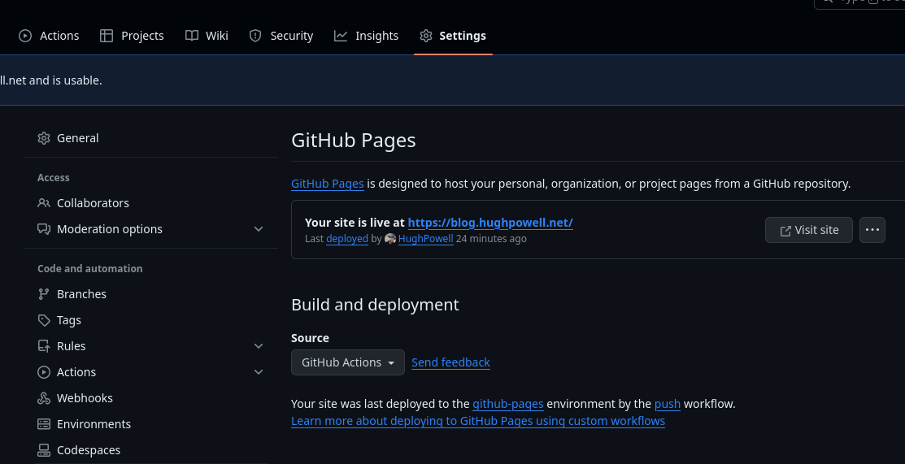
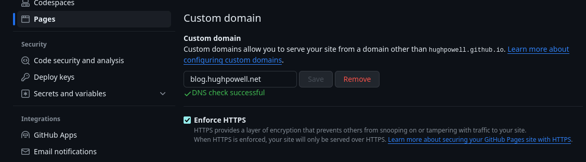

Title: My first blog post
Date: 2024-01-05
Tags: quickblog

So this is my first post. Not the first first post I've written, but maybe this
time it'll stick (hopefully). I'm using [quickblog](https://github.com/borkdude/quickblog/) from the incomparable
[borkdude](https://github.com/borkdude). Once I had followed the instructions in the README to get a skeleton first post
up, I headed over to the [Anders Means Different](https://www.eknert.com/blog/quickblog) blog for instructions on how to
get my blog published on GitHub pages using GitHub Actions.

Having copied the [yaml workflows](https://github.com/anderseknert/blog/blob/main/.github/workflows/push.yaml) file to
my blog's `.github/workflows/` directory, the initial deployment failed. This is because I had failed to set the `Build
and Deployment`: `Source` as "GitHub pages", rather than "Deploy from a branch", in my blog's repo.

Once I successfully re-ran the `deploy` action I could reach my shiny new blog at
[https://hughpowell.github.io/blog](https://hughpowell.github.io/blog). GitHub automatically serves the site at
<your-username>.github.io/<repo-name>.

Having got everything up and running on GitHub pages I now wanted to see if I could have it served from a custom domain.
Thankfully that's pretty straight forward, you just need to create a CNAME record in your DNS host. In may case this was
pointing from `blog.hughpowell.net` to `hughpowell.github.io/blog`. The last thing was to tell GitHub that I was using
a custom domain and wait for it to pick it up and generate an HTTPS certificate for my custom domain.

That's all for now. In my next post I plan to start working through [Mark Seemann's](https://blog.ploeh.dk/about/) book
[Code that fits in your head](https://www.oreilly.com/library/view/code-that-fits/9780137464302/) and translating the
examples into Clojure.
